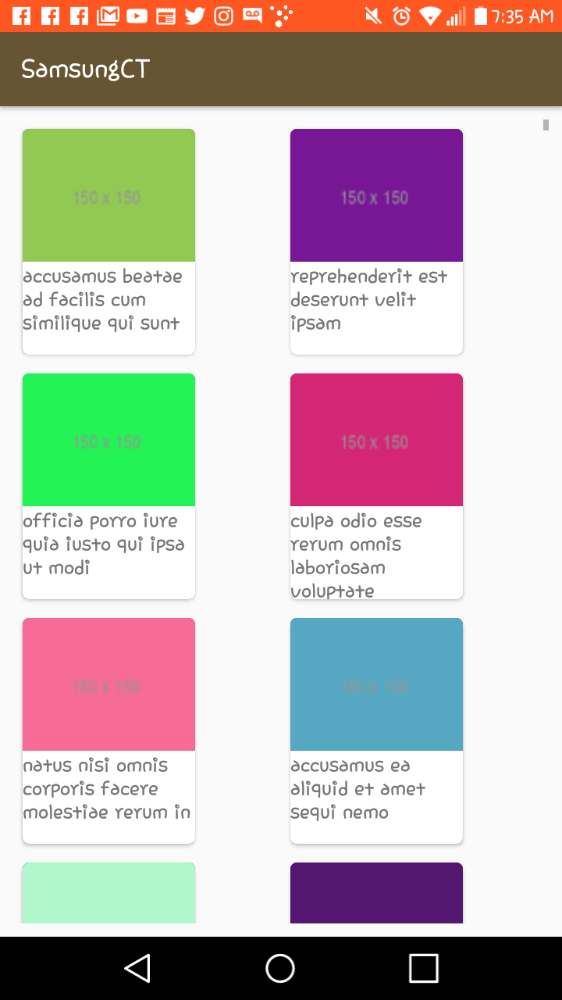
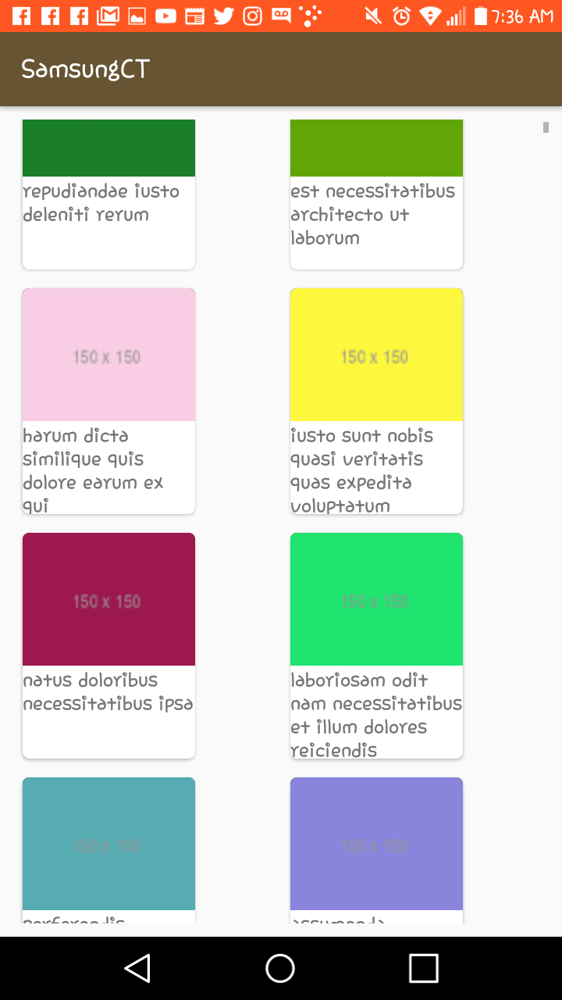

# Test-week-4

Phase 1
1. Setup and initial android studio project
2. Setup Retrofit, Picasso, RecyclerView and CardView to project
a. If you do not want to use Picasso or Retrofit feel free to use any other tools for network connections and image fetching

Phase 2
1. Download photos from url: https://jsonplaceholder.typicode.com/photos 2. Thumbnails should be rendered in a recycler view in a 2x2 column grid

Phase 3
1. User can click on thumbnail to see to see the picture with title details.

Phase 4
1. There should be a favorite button in title bar that when user clicks should mark album favorite.
2. Favorite should persist in a database created via room or any database library of choice
    
    
    
    
    
    
    
    
